# Comprehensive Website Improvement Plan

This plan is based on the current **Campbell CTRL** codebase: a React 19 + Vite 7 SPA with Tailwind, GSAP, and Firebase (Firestore + Auth), tab-based routing, and admin dashboard. Improvements are grouped by area and ordered by impact and dependency. Use **Campbell CTRL** as the primary name throughout; for meta/social description you can use a subtitle once (e.g. "Campbell CTRL – Campbell High esports").

---

## 1. SEO and discoverability

**Current gaps:** Single `<title>`, no meta description, no Open Graph/Twitter tags, no per-route meta. Favicon in [index.html](index.html) currently points at `/vite.svg`; the repo has both `public/vite.svg` and `public/logo-transparent.png`.

- **Meta and social tags**  
  In [index.html](index.html): add `<meta name="description" content="...">`, and optional OG/Twitter tags (e.g. `og:title`, `og:description`, `og:image`) for sharing. Use a short, unique description (e.g. "Campbell CTRL – Campbell High esports: schedules, standings, and updates").
- **Dynamic document title**  
  Update `<title>` when the tab changes in [App.jsx](src/App.jsx) via `document.title` or a small effect in the component that renders each tab. **All five tab routes** should get a title: e.g. "Home | Campbell CTRL", "Esports | Campbell CTRL", "Meetings | Campbell CTRL", "Legal | Campbell CTRL", "Admin | Campbell CTRL".
- **Favicon**  
  Update `<link rel="icon">` in [index.html](index.html) to the asset you want. If using the logo: `href="/logo-transparent.png"` and `type="image/png"`. If keeping the default, leave `href="/vite.svg"` and `type="image/svg+xml"`.
- **Optional (if deployed with a static host)**  
  Add a minimal `robots.txt` and, if you have a sitemap, a sitemap reference. [public/_redirects](public/_redirects) already has `/* /index.html 200` (Netlify-style); if you deploy elsewhere (e.g. Vercel, Cloudflare Pages), use that host’s redirect/single-page config so all routes serve `index.html`.
- **Optional (fuller SEO):** If the site has a single production URL, add `<link rel="canonical" href="https://...">` in index.html. Optional: JSON-LD (Organization / Event) for rich results—low priority unless you target that.

---

## 2. Accessibility (a11y)

**Current state:** Some `aria-label`s and `alt` text exist; Navbar logo has empty `alt` and the clickable area is a `
` with no accessible name; no `aria-current` on nav; no skip link; Suspense fallback is `null`; modal focus and keyboard behavior not fully audited.

- **Navbar logo**  
  In [Navbar.jsx](src/components/Navbar.jsx) (around line 237): change the wrapper from a `
` to a `<button type="button">` (or `<a href="/home">`) with `aria-label="Campbell CTRL – home"` so the control is focusable and announced. Give the `img` a descriptive `alt` (e.g. "Campbell CTRL logo") or keep `alt=""` if the button’s aria-label provides the name.
- **Active tab indication**  
  On the active nav item (desktop pill and mobile menu), add `aria-current="page"` so screen readers know which section is current. Apply in [Navbar.jsx](src/components/Navbar.jsx) on both the desktop `NavLink` buttons and the mobile menu buttons that receive `currentTab === 'home'` etc.
- **Skip to main content**  
  Add a "Skip to main content" link at the very start of the body (e.g. in [App.jsx](src/App.jsx) before the nav) that is focusable and scrolls/focuses `#main-content`. Style it to be visible on focus (e.g. fixed top-left, shown on `:focus-visible`).
- **Suspense fallback**  
  In [App.jsx](src/App.jsx), replace `<Suspense fallback={null}>` with a minimal fallback (e.g. a small skeleton or "Loading…" for the main content area) so users with slow networks or screen readers get feedback while tabs load.
- **Modal and form accessibility**  
  In [AdminDashboard.jsx](src/components/AdminDashboard.jsx) and [CalendarModal.jsx](src/components/CalendarModal.jsx): ensure modal has `role="dialog"`, `aria-modal="true"`, and `aria-labelledby`/`aria-describedby` where appropriate; trap focus inside the modal and restore focus on close; allow Escape to close if not already. Ensure all interactive elements (nav, theme toggle, Discord link, admin entry) are reachable by Tab. Check [FormControls.jsx](src/ui/FormControls.jsx) and [AnimatedInput.jsx](src/ui/AnimatedInput.jsx) for proper `<label>` association and error messaging (e.g. `aria-invalid`, `aria-describedby` for errors).
- **Images**  
  [SharedUI.jsx](src/components/SharedUI.jsx) and GameIcon use `alt={game}`; keep descriptive alts. Hero in [Hero.jsx](src/components/Home/Hero.jsx) already has a good `alt`. Ensure any other decorative images use `alt=""` and `aria-hidden="true"` where appropriate.

---

## 3. Performance

**Current state:** Lazy-loaded tabs and manual chunks (GSAP, Firebase, Lucide) are in place; fonts and Hero image are areas to optimize.

- **Font loading**  
  [index.html](index.html) loads multiple Google Fonts; the URL already includes `display=swap`. Confirm `font-display: swap` is present. Reduce to the weights actually used in [index.css](src/index.css) and [tailwind.config.js](tailwind.config.js) (e.g. Plus Jakarta Sans, Outfit, Playfair Display, Roboto, JetBrains Mono) and only the weights you use. Optional: self-host or preload the critical font(s) to reduce render-blocking.
- **Hero image**  
  [Hero.jsx](src/components/Home/Hero.jsx) uses a large Unsplash URL. Add `loading="eager"` and keep `fetchpriority="high"`. Add explicit `width`/`height` or a stable `aspect-ratio` container to reduce layout shift (CLS). If you have a CDN or build step, consider a responsive `srcset` or WebP/AVIF for smaller viewports.
- **Game icons**  
  [SharedUI.jsx](src/components/SharedUI.jsx) and [gameUtils.js](src/utils/gameUtils.js) reference [public/game-icons/*.png](public/game-icons/). Ensure they are reasonable size; if they appear below the fold, use `loading="lazy"` on the `` in `GameIcon`.
- **Bundle**  
  Current [vite.config.js](vite.config.js) manual chunks are good. After changes, run `npm run build` and check bundle size; consider code-splitting the admin dashboard if it’s large and only loaded when needed.

---

## 4. UX resilience (data and errors)

**Current state:** Firestore data is live via `onSnapshot`; no loading or error UI; auth errors are shown in AdminDashboard; Firestore/offline failures are not surfaced to the user.

- **Initial load / empty state**  
  When `gamesList`, `standings`, or `rankings` are still empty (e.g. before first snapshot), show a subtle loading or "Loading schedule…" in the components that depend on them ([HomeTab.jsx](src/pages/HomeTab.jsx), [EsportsTab.jsx](src/pages/EsportsTab.jsx), and any shared components like [LiveStandings.jsx](src/components/LiveStandings.jsx)). Avoid layout jumps (e.g. reserve min height or skeleton).
- **Firestore error handling**  
  In [App.jsx](src/App.jsx), the `onSnapshot` for `global/data` has no `onError` or catch. Add an error callback to the listener; set a small piece of state (e.g. `dataError: string | null`) and show a non-blocking message (e.g. banner or inline "Couldn’t load latest data. Check connection.") when set. Optionally retry or offer a "Retry" button.
- **Offline / no data**  
  If the app is used offline, Firestore may serve cached data or fail. Consider a simple "You’re offline" or "Data may be outdated" indicator when the snapshot reports from cache or when a fetch fails, if you want to expose that.

---

## 5. Security and documentation

**Current state:** Firebase config uses `import.meta.env.VITE_*`; `.env` is gitignored; no `.env.example`; README is a single line; no Firebase rules in repo.

- **.env.example**  
  Create a `.env.example` (and keep `!.env.example` in [.gitignore](.gitignore)) listing all required variables with placeholder values. From [src/firebase.js](src/firebase.js), the seven variables are: `VITE_FIREBASE_API_KEY`, `VITE_FIREBASE_AUTH_DOMAIN`, `VITE_FIREBASE_PROJECT_ID`, `VITE_FIREBASE_STORAGE_BUCKET`, `VITE_FIREBASE_MESSAGING_SENDER_ID`, `VITE_FIREBASE_APP_ID`, `VITE_FIREBASE_MEASUREMENT_ID` (e.g. `VITE_FIREBASE_API_KEY=your_api_key`).
- **README**  
  Expand [README.md](README.md) with: one-line project description (Campbell CTRL – esports site), how to run (`npm install`, `npm run dev`), how to build (`npm run build`), that env vars are required (see `.env.example`), and optionally link to Firebase console for Firestore rules. No need to document every component unless you want a contribution guide.
- **Firebase rules**  
  No Firestore/Storage rules are in the repo. In Firebase Console: ensure `config/admins` and `global/data` are protected. For example: `config/admins` allow read for authenticated users (or only your app); `global/data` allow read for all (if schedule/standings are public), write only for authenticated admins. No code change required in this codebase for that.

---

## 6. Code quality and maintainability

**Current state:** No tests; `package.json` name is `"temp-vite"`; no visible lint issues from the explored files.

- **Package name**  
  In [package.json](package.json), rename `"name": "temp-vite"` to something like `"campbell-ctrl"` or `"campbell-ctrl-web"` for clarity.
- **Testing (optional but recommended)**  
  Add a minimal test setup (e.g. Vitest + React Testing Library) and one or two tests: e.g. that App renders and a tab switch updates the URL or visible content, and that a key component (e.g. Footer or Navbar) renders without throwing. This gives a baseline for future refactors.
- **Error boundary**  
  Add a simple React error boundary at app root (in [App.jsx](src/App.jsx) or [main.jsx](src/main.jsx)) so a runtime error in any tab or component shows a fallback UI ("Something went wrong") instead of a blank screen, and optionally a "Reload" button. Have the boundary log the error (e.g. `console.error` or an error-reporting call) for debugging in production.

---

## 7. Mobile experience and haptics

**Current state:** The app uses [web-haptics](https://www.npmjs.com/package/web-haptics) via [src/utils/haptics.js](src/utils/haptics.js) and [useHaptics](src/hooks/useHaptics.js). You already expose `selection`, `light`, `medium`, `heavy`, `rigid`, `success`, `warning`, and `error`. Usage is inconsistent: e.g. nav tabs and theme toggle use `selection` or `light`; admin tab switches use `selection`; confirm/cancel use `success`/`rigid`/`error` in some places. Mobile layouts use `touch-manipulation`, some `safe-area-inset`, and a mobile-only nav sheet.

**Goals:** Improve mobile UX (touch targets, safe areas, layout) and define a clear **haptic design system** so each interaction type has a distinct, consistent feel on supported devices.

### Mobile site improvements

- **Touch targets**  
  Ensure all interactive elements (buttons, nav items, links, form controls) meet a minimum ~44×44px tap area on mobile (or use generous padding). Audit [Navbar.jsx](src/components/Navbar.jsx) (mobile menu items, hamburger, theme toggle), [Footer.jsx](src/components/Footer.jsx), [AdminDashboard.jsx](src/components/AdminDashboard.jsx) (bottom tab bar, list actions), [CalendarModal.jsx](src/components/CalendarModal.jsx), [FormControls.jsx](src/ui/FormControls.jsx), and [GlobalRankingsPanel.jsx](src/components/Esports/GlobalRankingsPanel.jsx). Add or adjust `min-h-[44px]` / `min-w-[44px]` and padding where needed.
- **Safe areas**  
  Use `env(safe-area-inset-top)`, `env(safe-area-inset-bottom)` (and left/right if needed) for fixed headers, bottom navs, and full-screen modals so content is not hidden by notches or home indicators. [AdminDashboard.jsx](src/components/AdminDashboard.jsx) and [GlobalRankingsPanel.jsx](src/components/Esports/GlobalRankingsPanel.jsx) already use some; extend consistently to [Navbar.jsx](src/components/Navbar.jsx) (fixed top) and [Footer.jsx](src/components/Footer.jsx) if it sits at the bottom on mobile).
- **Mobile-only polish**  
  Consider: slightly larger tap areas for primary CTAs (e.g. "Join Discord", "Admin"); avoid hover-only states for critical actions on touch devices; ensure modals and sheets (Calendar, Admin, Rankings) are easy to dismiss (swipe or tap outside where appropriate).

### Haptic design system (different haptics per action)

Define a single mapping so the same *type* of action always triggers the same haptic. That way users learn what to expect (e.g. "light tap" = navigation, "success" = something saved or confirmed). Apply this in one place (e.g. a short comment in [src/utils/haptics.js](src/utils/haptics.js) or a small [docs/haptics.md](docs/haptics.md)) and then use it everywhere.

Suggested mapping (adjust to taste):

| Interaction type | Haptic | Example usage |
|------------------|--------|----------------|
| **Navigation / selection** | `selection` | Tab change, nav link click, segment/tab switcher (e.g. Home/Esports/Meetings, admin Schedule/Standings/Rankings), month/period toggle in date/time pickers. |
| **Light action / toggle** | `light` | Theme toggle, hamburger open/close, closing a modal or panel, picking a date/hour/minute, secondary button tap, "Cancel" or "Close". |
| **Primary action / open** | `medium` | Opening a modal or bottom sheet (e.g. Admin panel, Calendar modal, Rankings mobile sheet), "Admin" entry, primary CTA (e.g. "Join Discord" if you want it to stand out). |
| **Confirm / commit** | `success` | Saving schedule/standings/rankings, confirming time or date, "Done" / "Save" in forms, successful auth. |
| **Destructive / failure** | `warning` or `error` | Delete confirmation tap, failed login/save, validation error (e.g. `error` on failed submit, `warning` for "are you sure?"). |
| **Heavy / irreversible** | `rigid` | Executing delete (after confirm), or use `heavy` for a single strong "done" on critical actions. |

Optional: **soft** for very subtle feedback (e.g. scrolling past a section or hover-like feedback on touch); **heavy** for one-off emphasis if you want a stronger "primary CTA" than `medium`.

### Implementation steps

1. **Document the mapping**  
  Add the table (or your chosen mapping) to [src/utils/haptics.js](src/utils/haptics.js) as a comment or to a small `docs/haptics.md` so future changes stay consistent.
2. **Audit and align**  
  Grep for `haptics.` and `useHaptics()` across the app. For each call site, assign an interaction type from the table and change the trigger to the chosen haptic (e.g. modal open → `medium`, confirm save → `success`, delete confirm → `rigid`, cancel → `light`).
3. **Use haptics only on capable devices**  
  [web-haptics](https://www.npmjs.com/package/web-haptics) typically no-ops on unsupported devices; no code change needed unless you want to gate calls behind a "has Haptics" check to avoid no-ops.
4. **Optional: gate by touch**  
  If you want haptics only on mobile/touch devices, use [useMobile](src/hooks/useMobile.jsx) (`isMobile` or `isCoarse`) and call the haptic only when true; otherwise keep current behavior (no-ops on desktop).

### Files to touch (mobile and haptics)

- **Haptics:** [src/utils/haptics.js](src/utils/haptics.js) (document mapping), [src/hooks/useHaptics.js](src/hooks/useHaptics.js) (no change unless you add a "by interaction type" helper), and every component that calls `useHaptics()` or `haptics.*`: [App.jsx](src/App.jsx), [Navbar.jsx](src/components/Navbar.jsx), [Footer.jsx](src/components/Footer.jsx), [AdminDashboard.jsx](src/components/AdminDashboard.jsx), [CalendarModal.jsx](src/components/CalendarModal.jsx), [FormControls.jsx](src/ui/FormControls.jsx), [GlobalRankingsPanel.jsx](src/components/Esports/GlobalRankingsPanel.jsx), [MagneticGlowButton.jsx](src/ui/MagneticGlowButton.jsx).
- **Mobile UX:** [Navbar.jsx](src/components/Navbar.jsx), [Footer.jsx](src/components/Footer.jsx), [AdminDashboard.jsx](src/components/AdminDashboard.jsx), [CalendarModal.jsx](src/components/CalendarModal.jsx), [GlobalRankingsPanel.jsx](src/components/Esports/GlobalRankingsPanel.jsx) (touch targets and safe areas).

---

## Suggested order of work

```mermaid
flowchart LR
  subgraph quick [Quick wins]
    A[SEO meta + favicon]
    B[Navbar alt + aria-current]
    C[Skip to content]
    D[.env.example + README]
    E[Package name]
  end
  subgraph ux [UX and resilience]
    F[Suspense fallback]
    G[Firestore loading/error]
  end
  subgraph mobile [Mobile and haptics]
    M[Touch targets + safe areas]
    N[Haptic design system]
  end
  subgraph a11y [Deeper a11y]
    H[Modal focus + ARIA]
    I[Form labels]
  end
  subgraph perf [Performance]
    J[Fonts + Hero image]
  end
  subgraph quality [Quality]
    K[Error boundary]
    L[Vitest + 1–2 tests]
  end
  quick --> ux
  ux --> mobile
  mobile --> a11y
  a11y --> perf
  perf --> quality
```

**Phase 1 (quick):** SEO meta + dynamic title for all 5 tabs, favicon path in index.html, Navbar logo (button/link + accessible name) + `aria-current` on desktop and mobile, **skip-to-content link**, `.env.example`, README, package name.

**Phase 2 (resilience):** Suspense fallback, Firestore loading/empty and error handling.

**Phase 3 (mobile and haptics):** Touch targets (min ~44px) and safe-area insets on fixed nav/footer and modals; document haptic mapping in codebase; audit and align all haptic calls to the design system (navigation → selection, confirm → success, destructive → warning/error, etc.).

**Phase 4 (a11y):** Modal ARIA and focus trap, form labels and errors.

**Phase 5 (performance):** Font tuning, Hero image sizing/CLS/lazy where appropriate, game icons `loading="lazy"`.

**Phase 6 (quality):** Root error boundary (with logging), optional Vitest + baseline tests.

---

## Acceptance criteria (definition of done)

- **Phase 1:** Every tab updates `document.title`; meta description and correct favicon link are in index.html; skip link is focusable and targets `#main-content`; Navbar logo has an accessible name and active nav has `aria-current="page"`; .env.example lists all seven Firebase vars; README has run/build and env instructions; package name is updated.
- **Phase 2:** Firestore snapshot has an error callback and a visible non-blocking message when set; Suspense shows a loading state (e.g. "Loading…") instead of null; empty data states show loading or placeholder where needed.
- **Phase 3 (mobile and haptics):** Key mobile touch targets are at least ~44px; fixed nav/footer and modals respect safe-area insets; haptic mapping is documented (e.g. in haptics.js or docs); all haptic call sites use the agreed mapping (selection for nav, success for confirm, etc.).
- **Phase 4:** Modals have role="dialog", aria-modal, focus trap, and Escape to close; form controls have proper labels and error association.
- **Phase 5:** Hero has loading="eager" and stable dimensions/aspect-ratio; fonts pruned or preloaded as chosen; below-the-fold game icons use loading="lazy".
- **Phase 6:** Error boundary catches errors and shows fallback (and logs); optional tests pass.

---

## Files to touch (summary)

- **SEO:** [index.html](index.html) (meta, favicon link, optional canonical), [App.jsx](src/App.jsx) (dynamic title)
- **A11y:** [Navbar.jsx](src/components/Navbar.jsx), [App.jsx](src/App.jsx) (skip link, Suspense fallback), [AdminDashboard.jsx](src/components/AdminDashboard.jsx), [CalendarModal.jsx](src/components/CalendarModal.jsx), [FormControls.jsx](src/ui/FormControls.jsx), [AnimatedInput.jsx](src/ui/AnimatedInput.jsx)
- **Mobile and haptics:** [src/utils/haptics.js](src/utils/haptics.js) (document mapping), all components that use [useHaptics](src/hooks/useHaptics.js): [App.jsx](src/App.jsx), [Navbar.jsx](src/components/Navbar.jsx), [Footer.jsx](src/components/Footer.jsx), [AdminDashboard.jsx](src/components/AdminDashboard.jsx), [CalendarModal.jsx](src/components/CalendarModal.jsx), [FormControls.jsx](src/ui/FormControls.jsx), [GlobalRankingsPanel.jsx](src/components/Esports/GlobalRankingsPanel.jsx), [MagneticGlowButton.jsx](src/ui/MagneticGlowButton.jsx); plus Navbar, Footer, AdminDashboard, CalendarModal, GlobalRankingsPanel for touch targets and safe areas
- **Performance:** [index.html](index.html) (fonts), [Hero.jsx](src/components/Home/Hero.jsx), [SharedUI.jsx](src/components/SharedUI.jsx) / GameIcon
- **Data/UX:** [App.jsx](src/App.jsx) (snapshot error + loading state), [HomeTab.jsx](src/pages/HomeTab.jsx), [EsportsTab.jsx](src/pages/EsportsTab.jsx), shared components that show games/standings
- **Docs/config:** [.env.example](.env.example) (new), [README.md](README.md), [package.json](package.json); optional [docs/haptics.md](docs/haptics.md) for haptic mapping
- **Quality:** [App.jsx](src/App.jsx) or [main.jsx](src/main.jsx) (error boundary), new test file(s) and Vitest config if adding tests

---

This plan keeps your existing architecture (tabs, Firebase, GSAP, Tailwind) and focuses on discoverability, accessibility, robustness, maintainability, and mobile experience (touch targets, safe areas, differentiated haptics). If you tell me your priority (e.g. "SEO and a11y first", "mobile and haptics only", or "performance only"), the work can be scoped to that.
